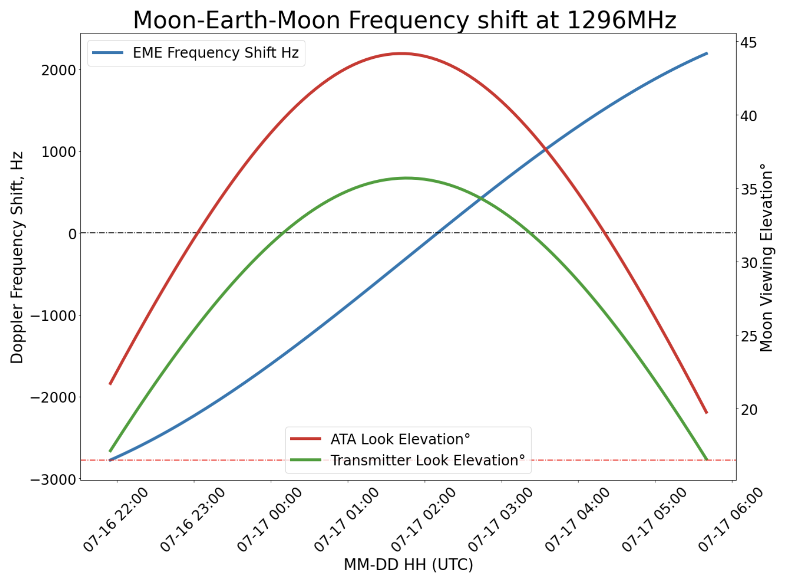

# Plan for Moon Experiment 1

## July 16, 2021

## Overview
### Purpose
We wish to perform some experiments to characterize signals, transmitted by a transmitter operated by VA7MM, which are reflected by the Moon and received at the Allen Telescope Array (ATA). The signals received at the ATA will be recorded to digital files and pushed to the Cloud for further analysis.

This is the general plan...

### Observation Time Criteria
When is a good time to observe? Here are the selection citeria and how we arrived at this date:

1. On July 16, 2021 the Moon elevation at the ATA reaches its peak around 1:50UTC (18:50PDT) at 45 degrees. 
2. The VA7MM transmitter location sees the Moon peak at the same time with an elevation of 35 degrees. 
3. The angular sky distance between the Sun and Moon at this time is > 75 degrees
4. The VA7MM transmitter guys are available to transmit over this time period
5. The ATA is available to observe and record data for us over this time period

## Status

### Complete:

1. The VA7MM guys are available to transmit on July 16

### TODO: 
1. Our group agrees this is a good time to perform this observation
2. Finish the official proposal for the ATA time and get them to agree to perform the observation at this time
2. Our group needs to agree on a the signals to broadcast
3. Stu: Determine which Moon locations and frequencies are best to concentrate on
4. Jon: create the WAV audio files 
45 Jon: create a program to extract the valid data channel(s) from the recorded data so it can be easily pushed to the Cloud
 
## Proposed Audio Schedule
*Keep in mind the transmitter can only transmit up to one minute at a time, then the transmitter needs to rest a minute.*

1. 5 minutes - Warmup: Broadcast music such as Beethoven's 5th symphony, something with a beat we would recognize. This would show us what a cacophony of signals look like.
2. 10 minutes - Power levels: Experiment with varying the transmitter power output. Create a WAV file of a simple sine wave and have the transmitter guys vary the power.
3. 10 minutes - Blips: Experiment with audio that contains a range of short bursts of a sine wave from the Transmitter. Can we effectively utilize a blip that is essentially a delta function?
4. 90 minutes - Main observation: A series of sine waves at steady and varying frequencies. More details, what this actually will be, will follow. 

## Elevation and Doppler Shift
This graph shows the elevation of the Moon during this time period (the left axis), as well as the Doppler shift of a 1296MHz sine wave transmitted from the VA7MM transmitter and received at the ATA (the right axis).

## Doppler Shift Over This Day
This movie shows the Doppler shift of a 1296MHz signal, as bounced off various locations os the Moon. The time period is the entire time the Moon is visible on July 16, 2021.

The locations on the Moon are roughly 80 degrees in latitude or longitute from the center of the Moon. Due North, due South, NE, E, SW, etc.

Here is the legend for the movie above, in better resolution:

## Positions of the Moon and Sun during July and August

This graph was used to determine the best time for observing in July:

